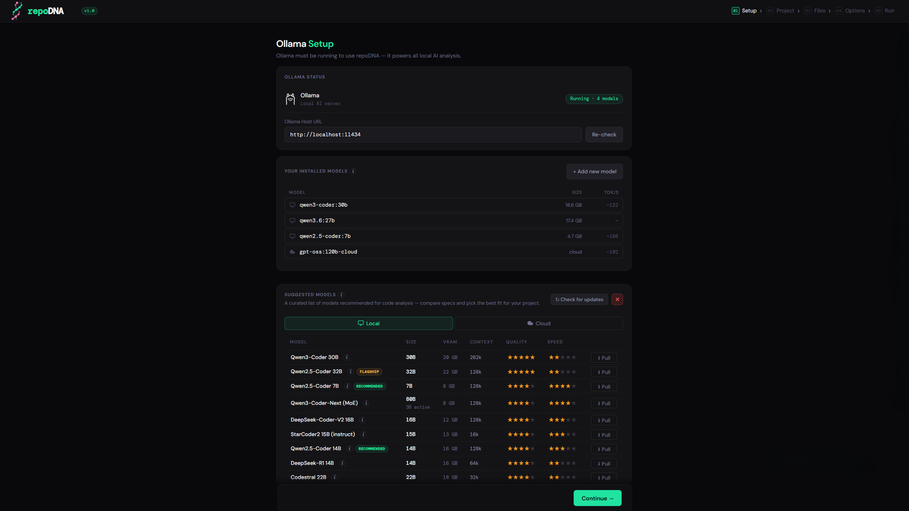
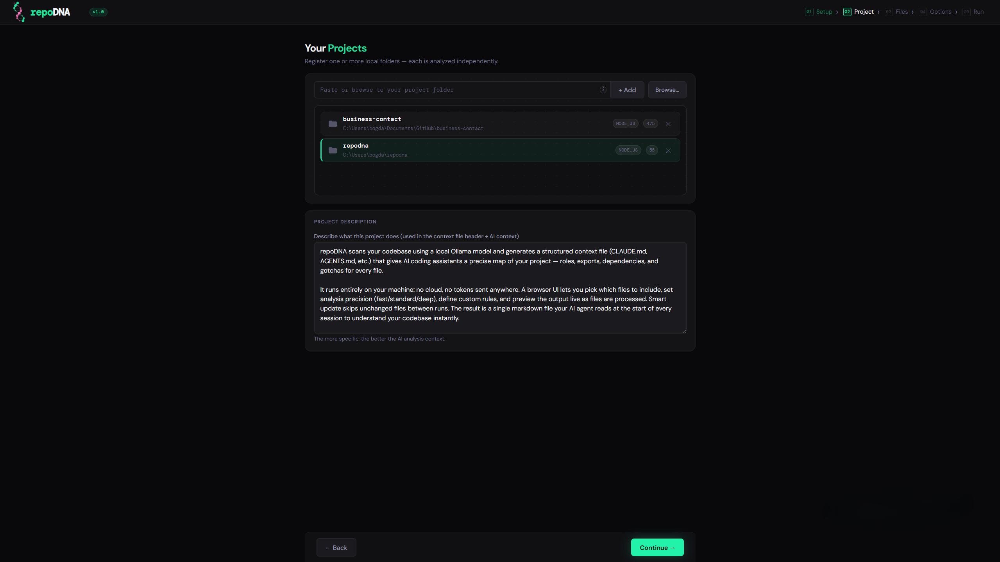
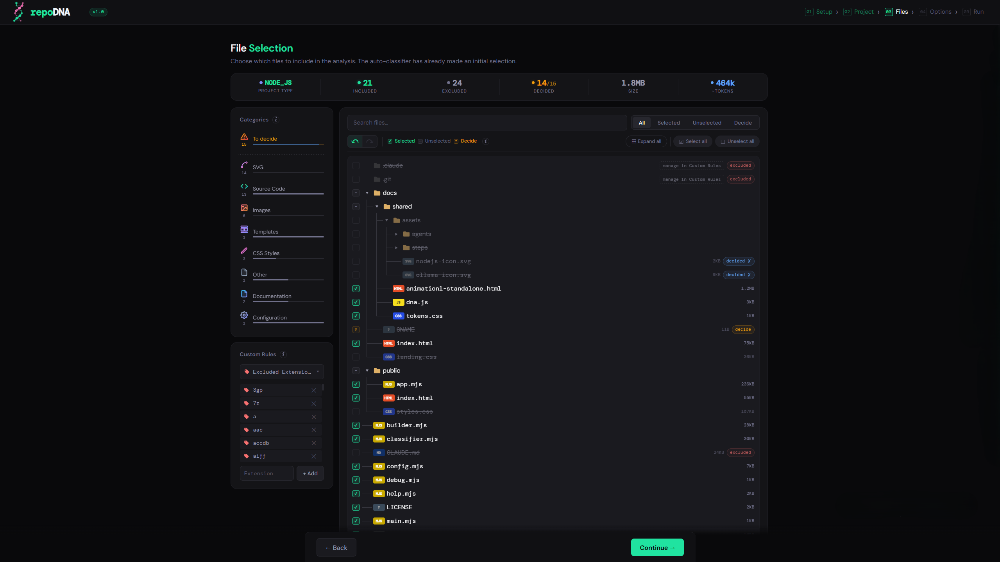
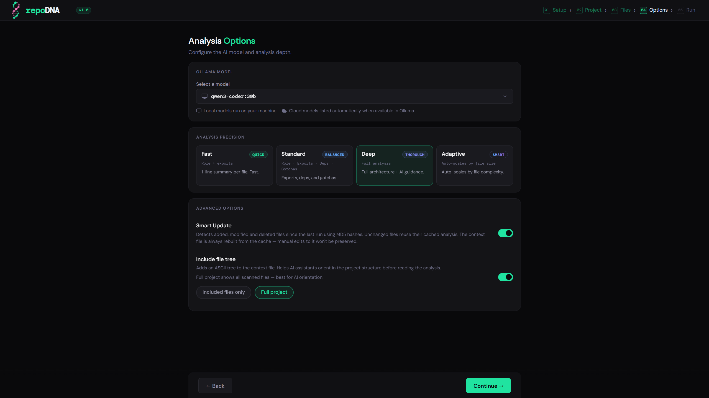
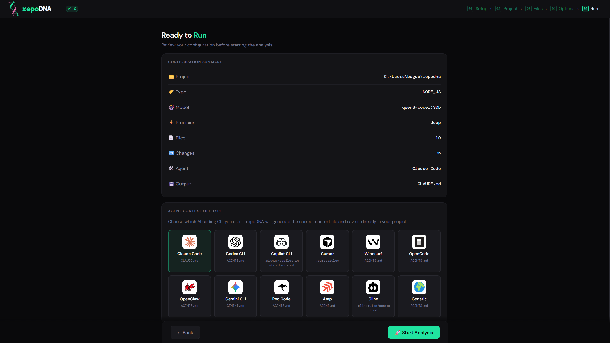
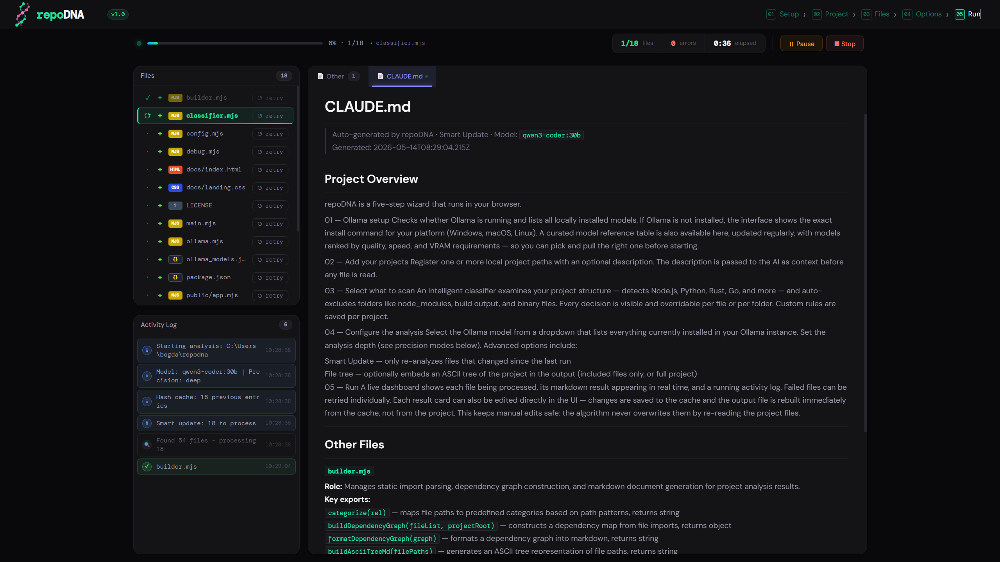

<div align="center">

# repoDNA

**Generate AI context files from any codebase — locally, privately, in minutes.**

🌐 **[repodna.com](https://repodna.com)**

[](./LICENSE)
[](https://nodejs.org)
[](https://ollama.com)


</div>

---

Every time you start a new session with your AI coding assistant, it starts from zero — no memory of your project, its structure, or its conventions. You spend the first minutes of every session re-explaining the same things.

repoDNA fixes this. It scans your codebase with an [Ollama](https://ollama.com) model and generates a structured context file your AI assistant reads at the start of every session — so it already understands your project before you write a single prompt. **No proprietary cloud API. No API keys. No accounts.**

Works with both local and cloud-hosted Ollama models — so you're not blocked if you don't have the hardware to run models yourself.

**No npm install. No build step.**  
The only thing you need to start is [Node.js](https://nodejs.org). Run one command and the browser UI opens — it guides you through Ollama setup, model selection, and everything else from there.

## Quick Start

```bash
git clone https://github.com/BogdanVasaiu/repodna
cd repodna && node main.mjs
```

The UI opens automatically at **http://localhost:3741**.  
_(Pass `--no-open` to skip auto-launch in headless/CI environments.)_

> **Only requirement to start** — [Node.js 18+](https://nodejs.org). The UI handles the rest, including Ollama setup. Ollama can run locally or on any remote machine you have access to.

---

## How It Works

The entire process runs in a guided browser UI — open it, follow the steps, get your context file.

### 01 — Ollama Setup

Checks whether Ollama is running and lists all locally installed models. If Ollama is not installed, the interface shows the exact install command for your platform. A curated model reference table lets you compare and pull the right model — ranked by quality, speed, and VRAM requirements.



### 02 — Add Your Projects

Register one or more local project paths with an optional description. The description is passed to the AI as context before any file is read.



### 03 — Select What to Scan

repoDNA detects your project type and pre-selects what to scan. Dependencies, build output, and binaries are automatically excluded. Every decision is visible in a file tree — you can override anything, per file or per folder. Your custom rules are saved and reused on the next run.



### 04 — Configure the Analysis

Choose the Ollama model, set the analysis depth (see [precision modes](#analysis-precision)), and toggle advanced options: Smart Update to skip unchanged files, and an optional file tree embedded in the output.



### 05 — Run

**5.1 — Pick the output target.** Choose which AI agent's context file format to generate — CLAUDE.md, .cursorrules, copilot-instructions.md, and more.



**5.2 — Watch it run.** A live dashboard shows each file being processed, its markdown result appearing in real time, and a running activity log. Failed files can be retried individually. Each result card can be edited directly in the UI — changes are saved to the cache and the output is rebuilt from there, never by re-reading your project files.



---

## Supported Agents

| Agent | Output file |
|---|---|
| Claude Code | `CLAUDE.md` |
| Cursor | `.cursorrules` |
| GitHub Copilot | `.github/copilot-instructions.md` |
| Gemini CLI | `GEMINI.md` |
| Windsurf | `.windsurfrules` |
| Codex CLI | `AGENTS.md` |
| Cline | `.clinerules/context.md` |
| Roo Code | `AGENTS.md` |
| Amp | `AGENT.md` |
| OpenCode | `AGENTS.md` |
| OpenClaw | `AGENTS.md` |
| Generic | `AGENTS.md` |

The agent list grows with every release. [Open an issue](https://github.com/BogdanVasaiu/repodna/issues) if your tool is missing.

---

## Supported Project Types

repoDNA detects your project type automatically to ensure its manifest and config files are always included in the analysis.

Node.js · Python · Rust · Go · Ruby · PHP · Elixir · Java (Maven) · Java (Gradle) · Android · Kotlin · .NET · C / C++ · Swift · iOS · Flutter · Scala · Unity · Unreal Engine · Godot

Unknown project types still work — source files are picked up by extension and the generic defaults handle the rest. You can also define your own inclusion and exclusion rules per project directly from the UI.

---

## Analysis Precision

Four modes, selectable per run:

| Mode | What it produces |
|---|---|
| **Fast** | One-line role + exports list. Best for large codebases where speed matters. |
| **Standard** | Role, key exports, non-obvious dependencies, gotchas. Best balance. |
| **Deep** | Full architecture, side effects, ordering constraints, AI guidance. |
| **Adaptive** | Auto-scales per file by size — small files get Fast, large ones get Deep. |

---

## Smart Update

When enabled, repoDNA hashes every analyzed file with MD5. On subsequent runs:

- **Unchanged files** → result served from cache instantly
- **Modified files** → re-analyzed
- **New files** → analyzed and added
- **Deleted files** → removed from output

The context file is always rebuilt from the internal cache (`~/.repodna/`), never by re-reading the project directly. Manual edits made through the UI are preserved across runs.

---

## Data Storage

All repoDNA data lives in `~/.repodna/` — never inside your projects. The only file written to a project is the context file itself (e.g. `CLAUDE.md`).

```
~/.repodna/
  config.json              ← global settings and project list
  projects/
    <encoded-path>/
      hashes.json          ← MD5 cache for smart update
      results.json         ← cached analysis results
      new-files.json       ← new file tracking
```

---

## Other Commands

**Help** — lists all available commands and their flags:

```bash
node help.mjs
# or
node main.mjs --help
```

**Debug mode** — writes per-file timing and stats to `repodna-debug.log`:

```bash
node main.mjs --debug
```

**Update** — checks GitHub for a newer release and pulls it automatically. Your data in `~/.repodna/` is never touched:

```bash
node update.mjs

# Stash uncommitted local changes, update, then restore them:
node update.mjs --force
```

**Uninstall** — removes `~/.repodna/` and all cached data. The cloned folder can then be deleted normally:

```bash
node uninstall.mjs --yes
```

---

## License

MIT — see [LICENSE](./LICENSE).

The name **repoDNA**, the logo, and the domain **repodna.com** are the exclusive intellectual property of Bogdan Marian Vasaiu and are not covered by the MIT license. See the LICENSE file for the full brand reservation notice.
